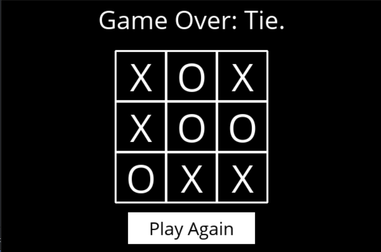

# TicTacToe Player in Python (Originally Completed for CS50AI)
[Click here to go to the solution intended for CS50AI problem set 0b](https://github.com/freakingrocky/CS50AI/tree/main/Week0%20-%20Search/tictactoe)
### This is an unbeatable tic tac toe AI.

***To play:***
```cmd
git clone https://github.com/freakingrocky/CS50AI.git
cd "CS50AI/Week0 - Search/tictactoe"
python runner.py
```




