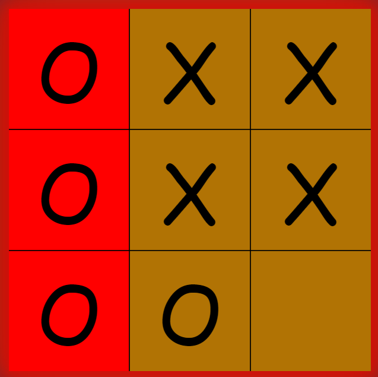
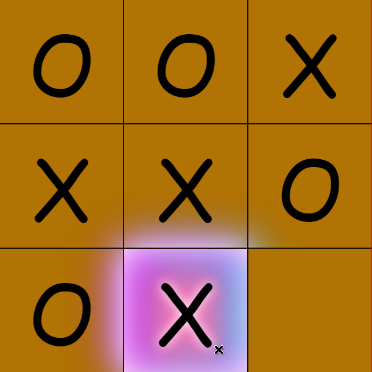
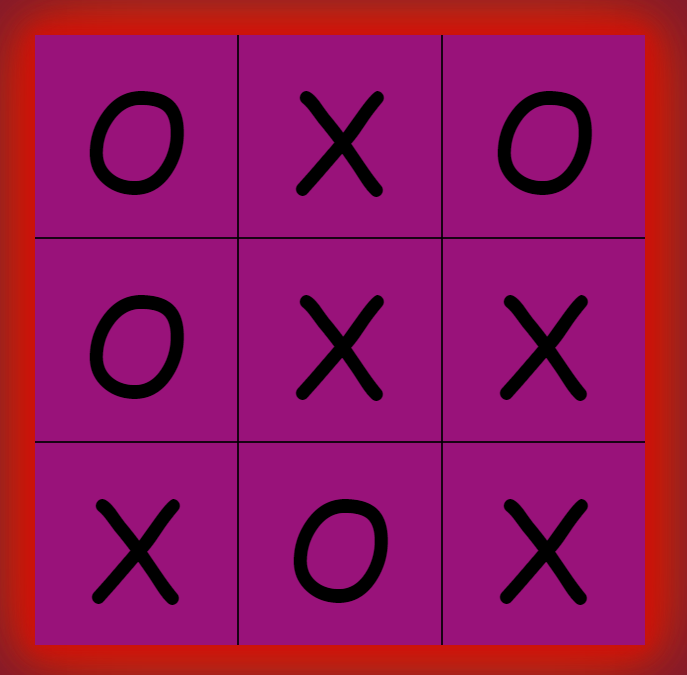

# [Unbeatable Tic-Tac-Toe AI (MiniMax Algorithm)](https://freakingrocky.github.io/tictactoe)
***[Click Here to Play](https://freakingrocky.github.io/tictactoe)***\

The algorithm's goal is to maximize the player score and minimize the opponent's score.\
It does so by exploring all *possible worlds,* (i.e. every possible move's results)
## Here's a visual to better understand it
Image taken from https://cs50.harvard.edu/ai/2020/notes/0/

I highly recommend watching the [CS50 2020 - Artificial Intelligence (pre-release)](https://www.youtube.com/watch?v=GUKDDbL24lI&t=1460s) segment on minimax.
